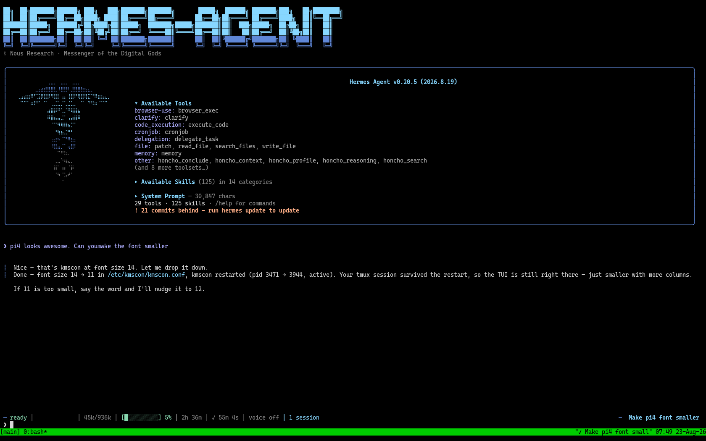
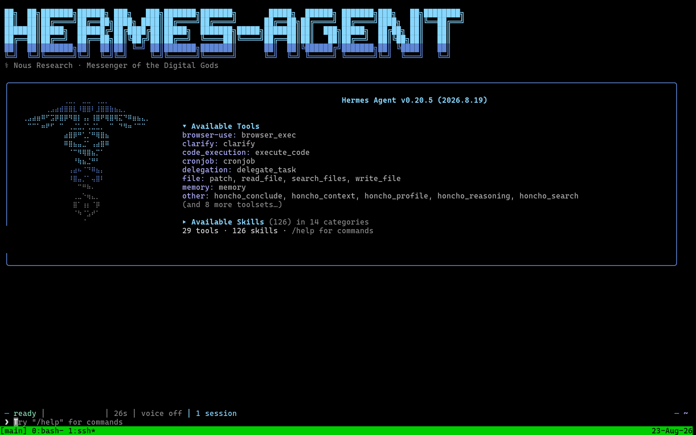

# pi-tty-nerdfont-console


## Beautiful Text-Mode Terminals on a Raspberry Pi

The purpose of this project is to show how to turn a Raspberry Pi into a
wall-mounted text terminal that actually looks good — Nerd Font glyphs, true
colour, native panel resolution, tmux, and a full-screen TUI that starts by
itself. No X, no Wayland compositor, no desktop.

I set this up because I wanted a small always-on screen showing a self-hosted AI
assistant. Those TUIs are drawn with Nerd Font glyphs, and on a stock Linux
console every one of them comes out as `▯`. I found the documentation scattered
and mostly wrong for the Pi, so I'm putting this out there along with detailed
instructions so other folks might have an easier time.

The stock Linux virtual console can't do the job. It renders a bitmap font at a
fixed 8x16 cell, has no font fallback, and caps out at 512 glyphs. The fix is
**[kmscon](https://github.com/Aetf/kmscon)**, a terminal emulator that talks
straight to KMS/DRM and renders TrueType through Pango, at the panel's real
resolution. You point systemd at `kmsconvt@tty1` instead of `getty@tty1` and the
console is simply better.

I built it twice, on two very different Pis, and they diverge almost right away:

| | `pi-zero` | `pi-4` |
|---|---|---|
| Board | Pi Zero 2 W | Pi 4 |
| OS | Raspberry Pi OS (Raspbian) trixie, **armhf** | Debian trixie, **arm64** |
| kmscon | `apt install kmscon` — one line | **no package exists**, build from source |
| DRM | one card, just works | **two cards**, kmscon picks the wrong one and hangs |
| Login hook | `tty`-based test | `tty` test **breaks on every restart** |
| Font size | 12 (small panel) | 14 (larger panel) |



This is an actual screenshot, not a photo of a monitor. It was captured over SSH
by reading kmscon's DRM framebuffer out of `/dev/mem` with
`scripts/grab-console.py`, since kmscon never touches `/dev/fb0`. Notice the
box-drawing, the disclosure triangles and the `❯` chevrons all rendering
properly. On a stock Linux VT every one of those is a `▯`.



Here's the same panel at `font-size=14` instead of 11. Because kmscon renders
TrueType through Pango rather than a fixed bitmap cell, font size is a one-line
config change and the grid re-flows to suit — 152x49 in this case. Mounted on a
wall a few feet away, bigger wins.

The banner at the top of this README was made on that console with
[`toilet`](https://caca.zoy.org/wiki/toilet). It's a fair test of whether your
setup is working:

```bash
sudo apt install toilet
toilet -w 152 -f pagga -F gay "pi-tty-nerdfont"
```

`pagga` is drawn entirely from Unicode block elements and `-F gay` colours it
with true-colour escapes. On a properly configured kmscon console you get the
image above. On a stock Linux VT you get a wall of `▯` in eight colours.

**[→ Read the full write-up in ARTICLE.md](ARTICLE.md)** — both builds, every
trap I hit, and why each one happens.

## What's in the repo

```
ARTICLE.md                       the story, both builds, every trap and why it happens
configs/kmscon.conf              /etc/kmscon/kmscon.conf
configs/autologin.conf           systemd drop-in for kmsconvt@tty1
configs/tmux.conf                ~/.tmux.conf (the two lines that matter under kmscon)
configs/bashrc-hook.sh           the console-launch hook (the portable version)
configs/61-kmscon-v3d-offseat.rules   udev rule — Pi 4 dual-DRM fix
configs/wifi-powersave-off.conf  NetworkManager - the glitchy-typing fix
scripts/build-kmscon-arm64.sh    source build for 64-bit Debian
scripts/install-nerd-font.sh     system-wide Nerd Font install + verification
scripts/assistant-tui.sh         the launcher the console actually runs
scripts/preflight.sh             12-point verification checklist
scripts/test-on-spare-vt.sh      exercise the real unit on tty4, never on tty1
scripts/grab-console.py          screenshot the live console via DRM + /dev/mem
assets/banner.png                the README banner, rendered on the console itself
assets/console-pi4.png           the pi-4 console at font-size 11
assets/console-pi4-font14.png    the same console at font-size 14
```

## Quick start

Start with the pieces specific to your board.

**64-bit Pi (`pi-4`):**
```bash
sudo bash scripts/build-kmscon-arm64.sh
sudo bash scripts/install-nerd-font.sh
sudo install -m644 configs/61-kmscon-v3d-offseat.rules /etc/udev/rules.d/
sudo udevadm control --reload-rules
sudo udevadm trigger --subsystem-match=drm --action=change
```

**32-bit Pi (`pi-zero`):**
```bash
sudo apt-get install -y kmscon tmux fontconfig
sudo bash scripts/install-nerd-font.sh
```

Then the common part for either board:

```bash
sudo install -m644 configs/kmscon.conf /etc/kmscon/kmscon.conf
sudo mkdir -p /etc/systemd/system/kmsconvt@tty1.service.d
sudo install -m644 configs/autologin.conf /etc/systemd/system/kmsconvt@tty1.service.d/
install -m644 configs/tmux.conf ~/.tmux.conf
cat configs/bashrc-hook.sh >> ~/.bashrc
sudo systemctl daemon-reload
sudo systemctl disable getty@tty1.service
sudo systemctl enable  kmsconvt@tty1.service
bash scripts/preflight.sh          # verify BEFORE rebooting
```

Edit `--autologin <user>` in `configs/autologin.conf` to match your account, and
point the launcher at whatever TUI you want on the screen.

Give it a try. It should work.

## Getting around in tmux

The console runs your TUI inside [tmux](https://github.com/tmux/tmux/wiki), and
that's doing real work for you. tmux keeps the session alive on the Pi itself, so
your program survives an SSH drop, a network blip, or a restart of the console
software. You can walk away and come back to exactly the screen you left.

If you've not used tmux before, here's just enough to get started.

Nearly every tmux command starts with a **prefix**: hold `Ctrl` and press `b`,
then let both go, then press one more key. It's two steps, not a chord. People
write it `Ctrl+B c`, meaning "prefix, then c".

| Keys | What it does |
|---|---|
| `Ctrl+B` then `c` | **C**reate a new window (a fresh shell alongside your TUI) |
| `Ctrl+B` then `n` | **N**ext window |
| `Ctrl+B` then `p` | **P**revious window |
| `Ctrl+B` then `w` | List all windows and pick one |
| `Ctrl+B` then `d` | **D**etach — leaves everything running, drops you to a plain shell |
| `Ctrl+B` then `?` | Every key binding there is |

Worth knowing separately: **`Ctrl+C` is not a tmux command.** It's the normal
Unix interrupt, and it stops whatever program is running in the current window.
Use it to break out of something that's stuck or scrolling forever. It doesn't
touch tmux itself, and it won't close the window.

To get back after detaching, or to reconnect over SSH:

```bash
tmux attach -t main
```

The bar along the bottom of the screen is tmux's, not your program's. The left
end lists your windows, and the one with an asterisk is the one you're looking
at.

One thing that catches people out: **tmux reads its config once, when the server
starts.** Editing `~/.tmux.conf` does nothing to a session that's already
running. Apply changes to a live session with:

```bash
tmux source-file ~/.tmux.conf
```

## A health signal worth knowing

```
tmux clients: /dev/pts/0: main [152x50 xterm-256color]
```

**152x50** means kmscon owns the display and is rendering at native resolution.
**80x23** means it isn't — that's the kernel framebuffer's default, which tells
you nothing took over the screen. The geometry alone tells you whether the build
worked, which is handy when you're checking remotely and can't see the panel.

## Licence

MIT — see [LICENSE](LICENSE).
